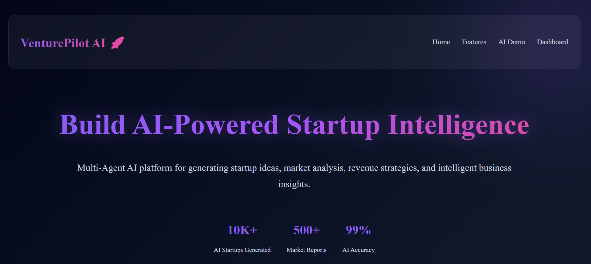
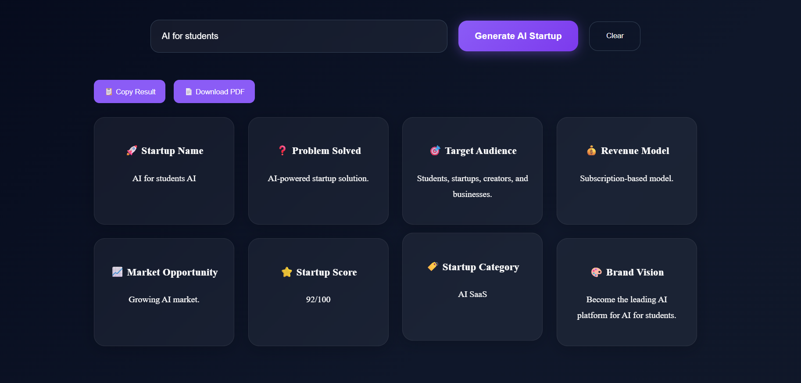
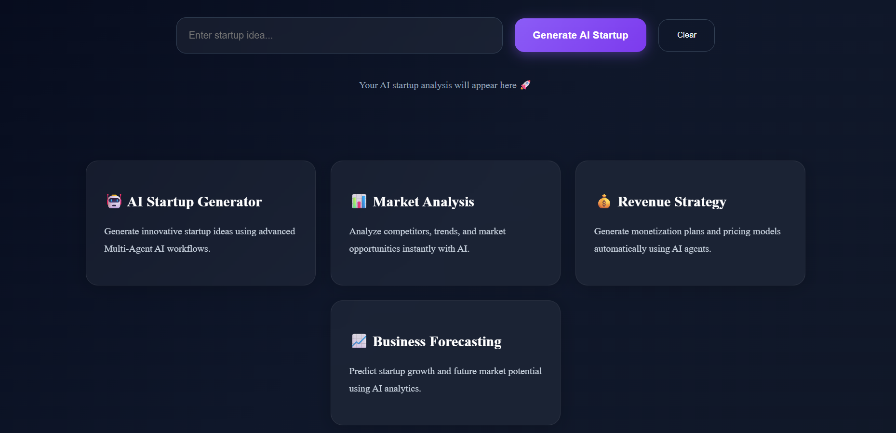
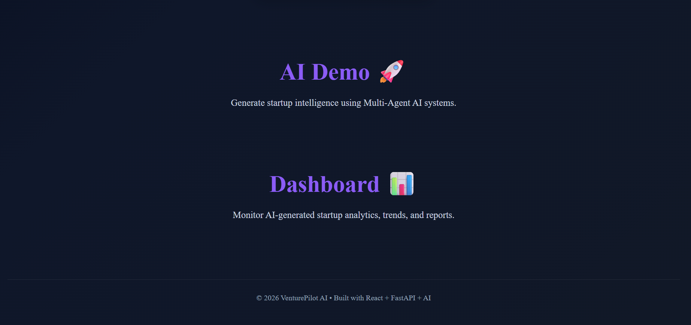

# 🚀 VenturePilot AI

An AI-Powered Startup Intelligence Platform that helps users generate startup ideas, analyze market opportunities, create revenue models, and explore business strategies using Artificial Intelligence.

## 🌟 Features

* 🤖 AI Startup Idea Generation
* 📊 Market Opportunity Analysis
* 💰 Revenue Model Suggestions
* 🎯 Target Audience Identification
* ⭐ Startup Scoring System
* 🏷️ Startup Category Classification
* 🎨 Business Vision Recommendations
* 📄 PDF Report Generation
* 📈 Interactive Dashboard
* 🔗 Frontend-Backend Integration

## 🛠️ Tech Stack

### Frontend

* React.js
* JavaScript
* HTML5
* CSS3
* Vite

### Backend

* FastAPI
* Python
* Gemini AI API

### Tools & Deployment

* Git
* GitHub
* Vercel
* Render

## 📸 Screenshots

### 🏠 Home Page



### 🚀 Startup Analysis Result



### ✨ Features Section



### 🤖 AI Demo


### 📊 Dashboard



## 📂 Project Structure

```text
startup-ai-platform/
│
├── backend/
│   ├── app/
│   └── requirements.txt
│
├── frontend/
│   ├── src/
│   ├── public/
│   └── package.json
│
├── screenshots/
├── docs/
├── datasets/
└── README.md
```

## ⚙️ Installation

### Clone Repository

```bash
git clone https://github.com/KUSUMA256/venturepilot-ai.git
```

### Frontend Setup

```bash
cd frontend
npm install
npm run dev
```

### Backend Setup

```bash
cd backend
pip install -r requirements.txt
uvicorn app.main:app --reload
```

## 🔮 Future Enhancements

* Multi-Agent AI Architecture
* Competitor Analysis
* SWOT Analysis
* Investor Pitch Generator
* Business Roadmap Generator
* Startup Report Export
* Cloud Deployment

## 👩‍💻 Author

**Kusuma srivalli Adapa**

B.Tech Artificial Intelligence & Machine Learning

GitHub:
https://github.com/KUSUMA256

## 📜 License

This project is licensed under the MIT License.
